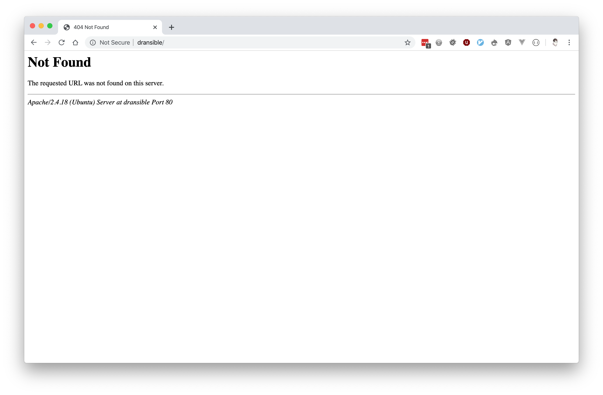
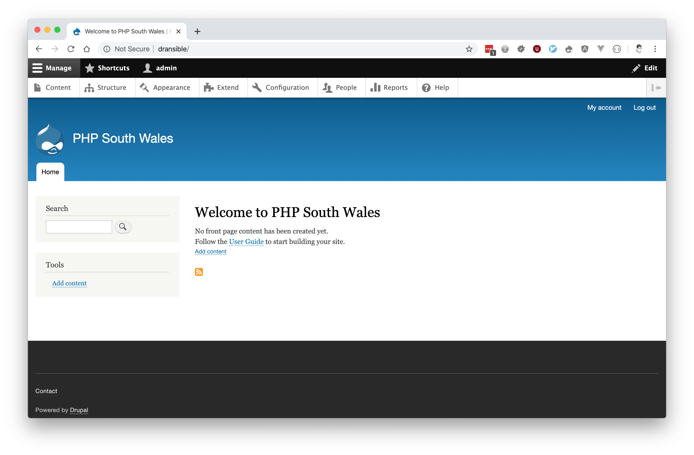

# Installation

1. Run `vagrant up` or `vagrant up --provision` if needed, to start Vagrant and provision the virtual machine using the `tools/ansible/provision.yml` playbook. This will set up a LAMP stack with Apache, MySQL, PHP and Composer.

    If you try loading the site at this point you will see a `The requested URL was not found on this server` message as the site has not yet been deployed.

    

1. Run the deploy playbook to deploy the application code to the virtual machine. You will be prompted for the Vault password, which is `dransible`.

    ```
    ansible-playbook tools/ansible/deploy.yml -i tools/ansible/hosts.yml --ask-vault-pass
    ```

1. Load `http://dransible` in a browser, and you should see a Drupal 8 website.

    
